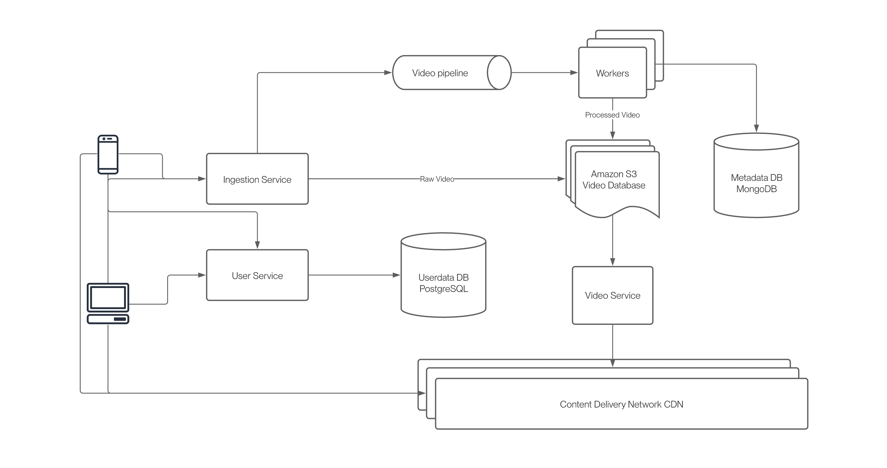

## Installation 

### First Steps

***Note:** You will need docker to run this application*

Clone the repository
```bash
git clone https://github.com/Vishal-Chdhry/content-sharing-platform.git
```

Install the dependencies
```bash
npm install
```

Start the database
```bash
docker compose up dev-db -d
```

### Running the app

```bash
# development
$ npm run start

# watch mode
$ npm run start:dev

# production mode
$ npm run start:prod
```

### Testing

```bash
# unit tests
$ npm run test

# e2e tests
$ npm run test:e2e

# test coverage
$ npm run test:cov
```
### *Learning System Design Right Now*

## Design
### Requirements
1. Eventual Consistency
2. High Availability
3. Fault Tolerance
4. Performance of upload- low SLAs
5. Low Latency between upload and user visibility
6. Low latency when distributed
7. __DAU:__ 10 Million
8. __Creators:__ 100K

### Conclusions
1. More reads than writes, *ratio is 1:100*
2. Total data per day = 100k creators * 2 video/day * 1MB/video * 3 different format * 2 for different resolutions = **1.2TB/day**


1. We will have 3 databases, Video database *(Amazon S3)*, metadata database *(MongoDB (key value))*, userdata database *(PostgreSQL)*
2. Since, there are 100k creators who can upload a lot of vidoes everyday, we will impliment the POST `/upload` through a queue.
3. We will be using S3 for video storage because of its reliability and because we can connect S3 buckets to CDNs across the globe for fast content delivery *(multiple point of failures and low latency)*.
4. We will be using mongodb for metadata because metadata is not so organised and the metadata can change overtime and key value pairs are faster to read enabling faster reads.
5. Firstly, every video will have to go through an ingestion system where several checks like length check, profanity check as well as format and size conversion will take place (parallel conversion)
6. Then it will be stored in different S3 buckets stored across the globe connected to a CDN
7. The metadata will be stored in MongoDB at the same time
8. To fetch a video we will be using the video metadata for info


## Endpoints
### POST `/upload`
**Params:** user_data, metadata, video *(max length = 60 sec)*